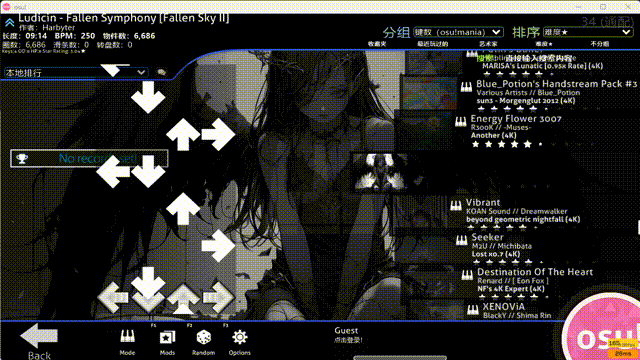

# Beatmap Preview（tosu 插件）

在选歌与游玩时实时预览当前谱面的下落动画：跟随 tosu 提供的谱面时间与玩家皮肤，在选歌界面即可看到谱面预览，进入游玩可自动隐藏。

> A real-time beatmap preview overlay for [tosu](https://github.com/tosuapp/tosu) (osu!mania).



## 1. 插件简介

这是一个 tosu 静态插件，面向 osu!mania：

- 在**选歌界面**渲染当前选中谱面的下落预览，时间轴与游戏预览音频同步；
- 使用 tosu 提供的**玩家皮肤**（解析 `skin.ini` 的 `[Mania]` 配置与自定义贴图），也可切换到内置默认皮肤（osu!stable / lazer 两套素材）；
- 只做「谱面预览」：不绘制分数、连击、判定，不影响游戏本身；
- 进入游玩时默认自动隐藏（可关闭），支持 OBS 浏览器源与 tosu 游戏内覆盖层。

## 2. 主要特性

- **实时预览**：跟随 `beatmap.time.live` 与谱面 timing（含 BPM / SV）渲染下落音符，选歌界面即可查看。
- **完整皮肤支持**
  - 解析 `skin.ini` 的 `[Mania]` 段：`ColumnWidth` / `ColumnSpacing` / `ColumnStart` / `HitPosition` / `StageHint` / `WidthForNoteHeightScale`；
  - `NoteBodyStyle` 支持全局与逐列级联（并按 `[General] Version >= 2.5` 决定默认值）；
  - 支持自定义 `NoteImage*` / `KeyImage*`（含子目录、动画帧 `-0`、大小写不敏感精确匹配）。
- **内置默认皮肤**：`default-skin/stable`、`default-skin/lazer` 两套 `@2x` 素材，关闭「Use Player Skin」时使用，无需外部文件。
- **高键数自适应**：6K 及以上、皮肤舞台宽度超出 480 时自动扩展渲染视口，整段舞台完整可见。
- **近似转换预览**：osu!standard 谱面按列近似转换预览；taiko / catch 显示提示。
- **性能优化**：静态层缓存、可见音符游标、局部清屏、`desynchronized` 画布、长条源矩形绘制；可选 FPS 上限。
- **可调设置**：背景色 / 不透明度、渲染缩放、滚动速度覆盖、不透明度、选歌显示、游玩自动隐藏、FPS 上限。

## 3. 使用方法

### 前置要求

- [tosu](https://github.com/tosuapp/tosu)（推荐 4.26+）；
- osu!stable 或 osu!lazer；
- 需要预览 mania 谱面（std 谱面会以近似转换方式预览）。

### 安装

将本仓库放到 tosu 的 `static` 目录下，目录名保持 `Beatmap Preview`：

```bash
# 方式一：git clone（可直接克隆进 static 目录）
git clone https://github.com/M1ch1bata/tosu-beatmap-preview.git "tosu/static/Beatmap Preview"

# 方式二：下载 ZIP 解压后，将文件夹重命名为 Beatmap Preview 放入 tosu/static/
```

重启 tosu 后，在 tosu 控制台的计数器 / 覆盖层列表中即可看到 **Beatmap Preview**。

### 添加为覆盖层

- **OBS**：添加「浏览器源」，URL 填
  `http://127.0.0.1:24050/Beatmap%20Preview/index.html`；
- **游戏内覆盖层**：在 tosu 设置中开启 `enableIngameOverlay`，并把本插件加入显示列表。

在选歌界面即可看到预览；进入游玩后默认自动隐藏。

### 设置项

| 设置 | 说明 | 默认 |
| --- | --- | --- |
| Background Color / Opacity | 背景色与不透明度（0 = 全透明） | `#000000` / `0` |
| Render Scale (%) | 谱面在窗口内的缩放 | `100` |
| Show In Song Select | 选歌界面显示预览 | 开 |
| Auto Hide In Gameplay | 进入游玩自动隐藏 | 开 |
| Use Player Skin | 使用玩家皮肤；关闭则使用内置默认皮肤 | 开 |
| Mania Scroll Speed Override | 覆盖游戏滚动速度（0 = 跟随游戏） | `0` |
| Playfield Opacity | 谱面 / 音符不透明度 | `1` |
| FPS Limit | 重绘帧率上限（0 = 不限） | `0` |

### 常见问题

- **预览没有使用我的皮肤？**
  确认游戏内已选择该皮肤，且插件设置中 `Use Player Skin` 为开；插件通过 tosu 的 `/files/skin/` 读取皮肤目录，无法读取时会回退到内置默认皮肤。
- **6K / 7K / 8K 显示不全？**
  0.7.6 起已按皮肤舞台边界自动扩展视口；若仍有异常请附 `skin.ini` 的 `[Mania]` 段反馈。
- **游戏内覆盖层卡顿？**
  调低 `FPS Limit`（如 60）或降低 `Render Scale`。
- **会显示判定 / 分数吗？**
  不会。本插件只做谱面下落预览；判定与回放可视化请使用 [tosu-mania-replay-master](https://github.com/M1ch1bata/tosu-mania-replay-master)。

## 4. 贡献指南

欢迎提交 Issue 与 PR。

### 报告问题

请附上：

- tosu 版本、客户端（stable / lazer）；
- 复现步骤（谱面、键数、皮肤名称与 `skin.ini` 相关段落）；
- 现象截图或录屏；如有需要可附 `tosu/logs/latest.log` 片段。

### 提交 PR

1. Fork 本仓库并新建分支（如 `fix/lazer-skin`）；
2. 修改后运行测试，确保全绿：

   ```bash
   node test/preview-mania-test.mjs   # 当前 16 项断言，无需安装依赖
   ```

3. 提交 PR，说明变更动机与验证方式。

### 开发说明

- 纯前端、无构建步骤：`main.js` + `index.html` + `main.css` + `settings.json` + `metadata.txt` + `default-skin/`；
- 浏览器调试接口：`window.__beatmapPreview`（暴露 state / 解析 / 渲染等函数）；
- 测试基于 Node 内置 `vm` 模拟 DOM，可在无 tosu 环境下验证解析、布局与渲染逻辑；
- 代码风格：2 空格缩进、保持现有模块内聚，避免引入全局变量与构建依赖。

## 致谢

- [tosu](https://github.com/tosuapp/tosu)：提供实时数据与插件平台；
- [osu! wiki](https://osu.ppy.sh/wiki/en/Skinning/skin.ini)：`skin.ini` mania 段与皮肤规范参考。

## 许可

[MIT](LICENSE)
